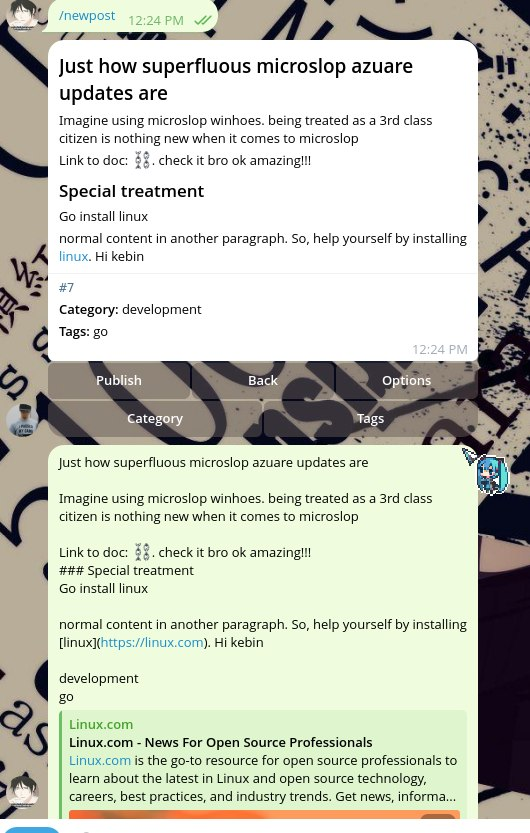

Draft and publish a post from your private chat with the bot: **one message, then one Publish tap**.

1. **Write the whole post in one message.**

   ```markdown
   /newpost A useful trick

   A short summary of the post.

   ## The idea
   Your Markdown content goes here.

   Category: concept
   Tags: code, my-new-tag
   ```

   You can also send `/newpost` first, then send the post. The title is the first
   line, the summary is the next paragraph, and the remainder is the Markdown
   body. The bot saves your draft and keeps one card for it.

   The optional final two lines set one category and multiple comma-separated
   tags. They are removed from the body. Use `Tags: -` for none. New names show
   `*` on the card and preview; the marker is never part of the saved name.

   Existing names also work without the `Category:` and `Tags:` labels. Use the
   labels for new names so trailing prose isn't mistaken for metadata.
   Single-line bodies and additions always stay content; footer lines must be
   together in the same message.

2. **Edit and preview without starting over.**

   Edit your original Telegram message to change the title, summary, body, or
   footer. The same card updates in place. Further messages append to the body;
   editing an appended message changes that addition. An addition can also end
   with the same category and tags footer; it updates the selections without
   adding the footer to the body.

   Tap **Preview** to see the formatted post, category, and tags. Preview stays
   enabled through edits and restarts; **Back** returns to the compact view.
   **Category** and **Tags** are directly on the card. Choose one category and
   toggle any number of tags. Suggested tags appear first, but you can select
   tags from any category.

   **Options** lets you replace the whole post, download it, undo the last
   addition, or cancel the draft.

3. **Keep several drafts going.**

   Send `/newpost` for another draft. Older drafts stay saved, and editing their
   original messages updates the corresponding cards.

   Reply to a draft's card or source message to append specifically there.
   Unthreaded text goes to the draft most recently selected with `/newpost`,
   `/resume`, or **Replace post**. Each draft's buttons work independently.

4. **Publish when you're ready.**

   Tap **Publish**. The card shows progress while you can keep working on other
   drafts. The post is saved as numbered Markdown in `content/tweets/`, with
   your selected category and tags. New names join the taxonomy, and the post
   and updated references land together on the repository's `main` branch.

   If you've configured a channel or group, the bot posts there after the repository
   publication succeeds. The card shows the result without another success
   message. Content is locked while publishing; `/delete` only removes drafts.

   If publication pauses, tap **Retry publish**. The bot checks whether the
   previous attempt already landed before continuing. If channel delivery is
   uncertain, check the channel before choosing the explicit retry button.

5. **Edit a live article whenever needed.**

   `/posts` lists live articles from the repository under **Today** and **Earlier**,
   showing their original dates. Running it again replaces the previous list
   with a new message. Tap **Preview #number** to view an article on the same
   list message without starting an edit. **Back** returns to the list.
   Tap **Edit #number**, use `/edit <number>`, or tap
   **Edit** on a published card. Pending changes resume on the same card and stay
   separate from `/drafts`.

   Reply to the list with an article number to show that article and the next
   older entries. The list updates in place and your reply is deleted; repeat
   whenever needed. **Refresh** fetches the list from Git and keeps the selected
   article at the top; refreshing the newest range shows the latest articles.

   The card says **Editing live**. When an original message is recorded, tap
   **Original message**, then tap the quote in the bot's small reply to open it.
   The reply clears when the card next updates. Edit the source, reply to the card
   to append (including an optional category and tags footer), or use `/replace`
   to rewrite the post. Preview, Category, and Tags work as usual.
   Tap **Save changes** to update the existing Markdown and taxonomy on `main`,
   keeping the article number, publication date, and URL. Associated channel posts
   and Markdown attachments are edited in place. Missing associations are skipped.

   **Discard changes** (or `/cancel`) keeps the published version. If someone
   changed the same article on Git, download your pending changes before choosing
   **Discard & reload**. A failed channel edit shows **Retry channel update**;
   retrying never creates a replacement post.

Useful commands while writing:

- `/taxonomy` — get a copyable list of categories and tags. Pin it yourself;
  the same message updates when the available names change.
- `/drafts` · `/resume <number>` — list saved drafts and select one.
- `/posts` · `/edit <number>` · `/save` — browse and edit live articles.
- `/download` — get the post's Markdown file; use its **Preview** button to view it.
- `/replace` — replace the whole post.
- `/undo` — remove the last appended text; its chat message stays. Edits,
  replacements, and taxonomy changes aren't undone.
- `/cancel` — delete the entire active unfinished draft and remove its card.
- `/delete <number>` — delete a specific unfinished draft. A number is required.
  Successful deletion gets a 👍 reaction or a brief confirmation.
- `/channels` — show the configured destination and its current permission status.
- `/setchannel @name` — set or change the channel or group. Add the bot as an
  administrator with permission to post, and be a member yourself. Changes apply
  to future publications; `/unsetchannel` disables destination posting.

Drafts survive restarts. Reply to an appended source with `/remove` to remove it
from the draft and clear both messages from the chat. **Review** entries have
matching **Source 1**, **Source 2**, … buttons that open a quoted reply the same
way. Replying to that bot reply with `/remove` also removes the referenced addition.
If the source is already gone, use the copyable `/remove <message ID>` shown
beside its entry.
